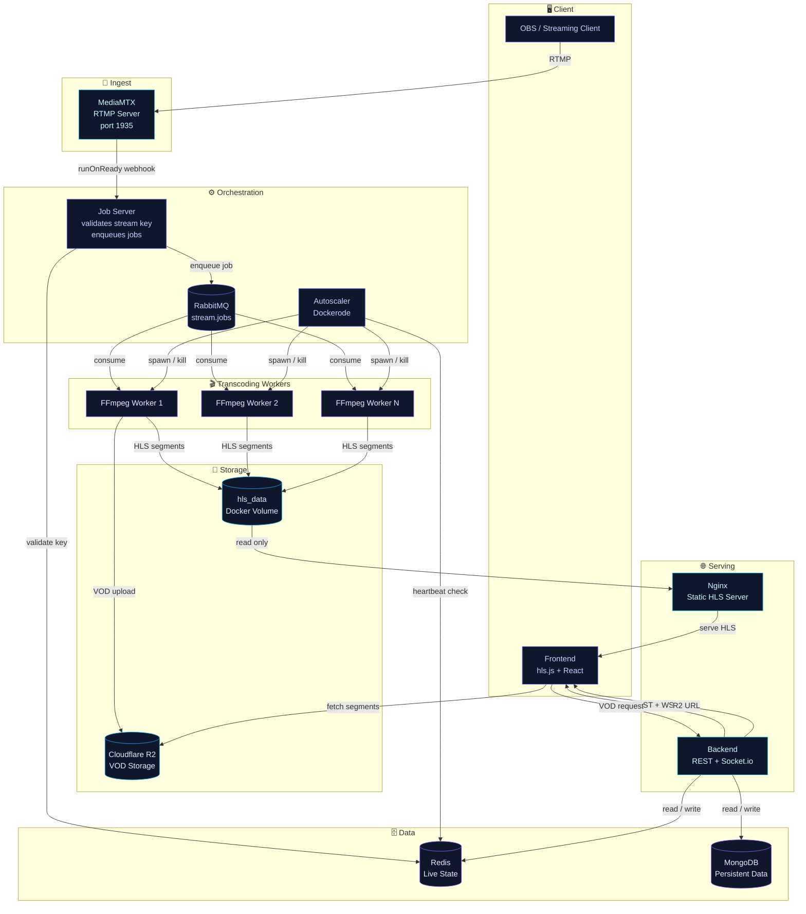
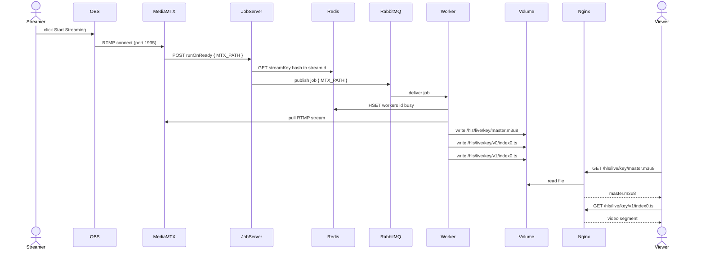
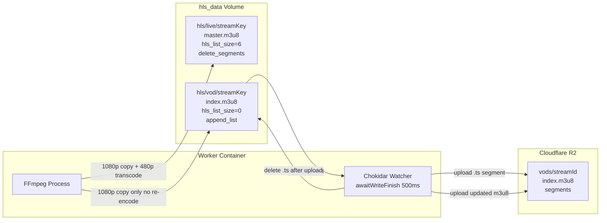
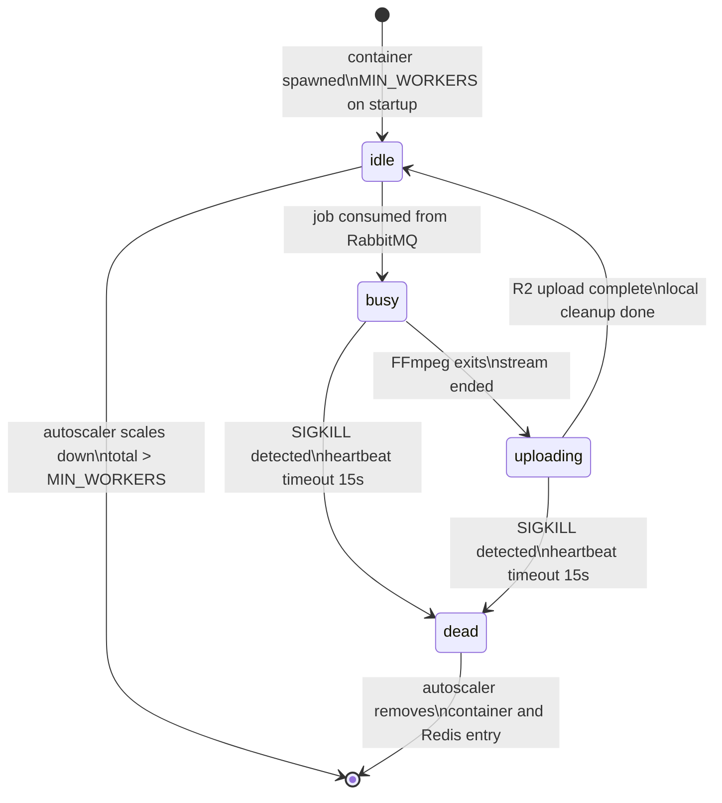
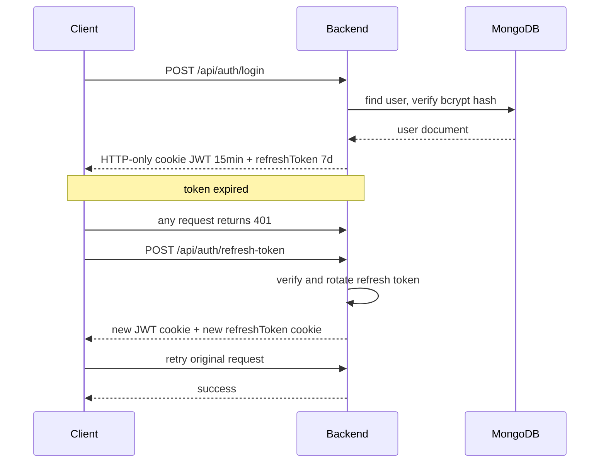
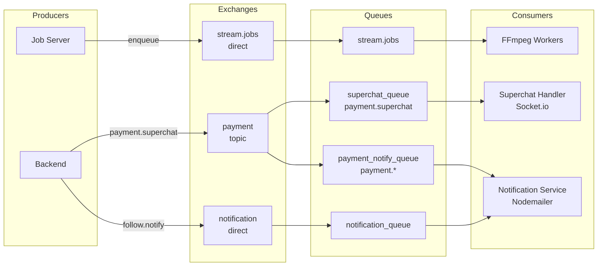
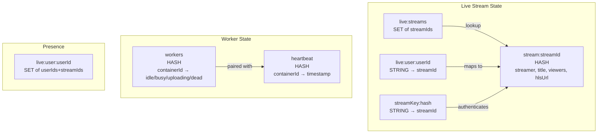

# iStream Architecture

## Overview

---

## Streaming Pipeline

> From OBS hitting the ingest server to the viewer receiving HLS in their browser.

---

## VOD Recording Pipeline

> Segments are uploaded to Cloudflare R2 as FFmpeg writes them. Disk usage stays constant regardless of stream duration.

---

## Autoscaler — Worker Lifecycle

---

## Auth Flow

---

## RabbitMQ Exchange Topology

---

## Redis Data Model

---

## Autoscaler — Worker Lifecycle

---

## Auth Flow

---

## RabbitMQ Exchange Topology

---
